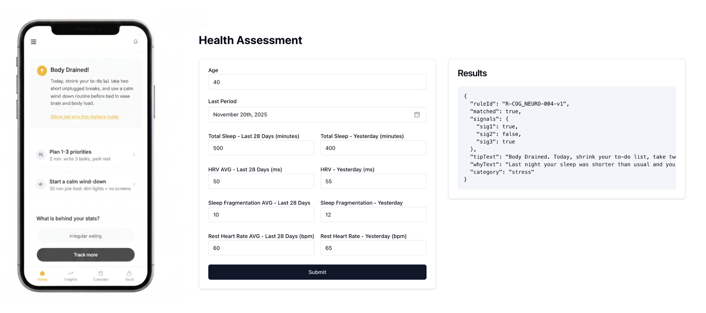

# Anna App

Health & wellness app for women in perimenopause.

## Screenshots

<p align="center">
  
</p>

## Setup

```bash
pnpm install
```

## Mobile App

### Run on Simulator

```bash
cd apps/mobile
npx expo start --ios
```

### Run on Physical iPhone

1. Connect iPhone via USB
2. Run:

```bash
cd apps/mobile
npx expo run:ios --device --configuration Release
```

3. Select your device from the list

### First Time on Device?

If you see "Untrusted Developer" error on your iPhone:

1. Open **Settings**
2. Go to **General > VPN & Device Management**
3. Tap your developer certificate
4. Tap **Trust**

## Web App

```bash
cd apps/web
pnpm dev
```

## API

```bash
cd apps/api
pnpm dev
```
